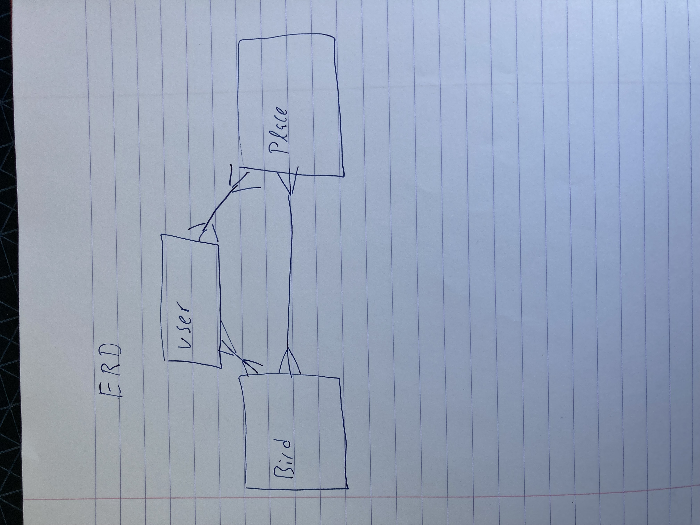
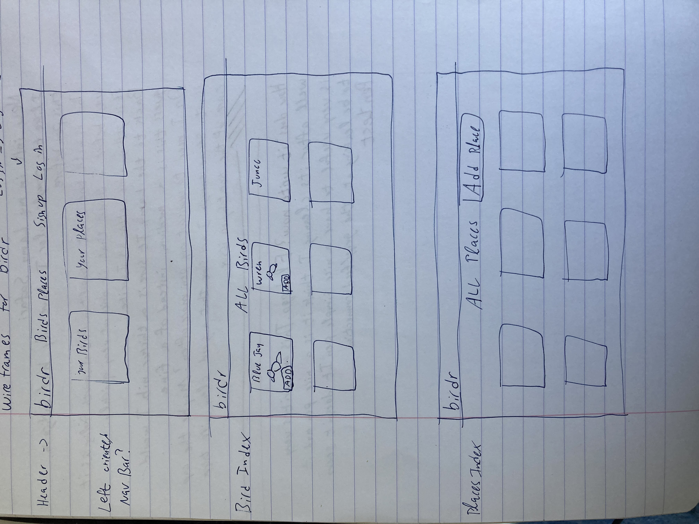
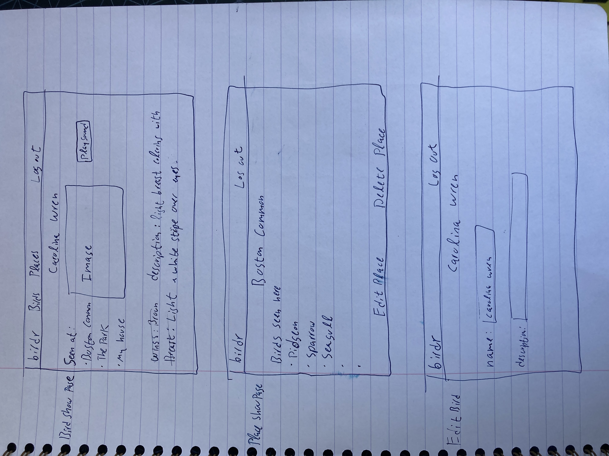
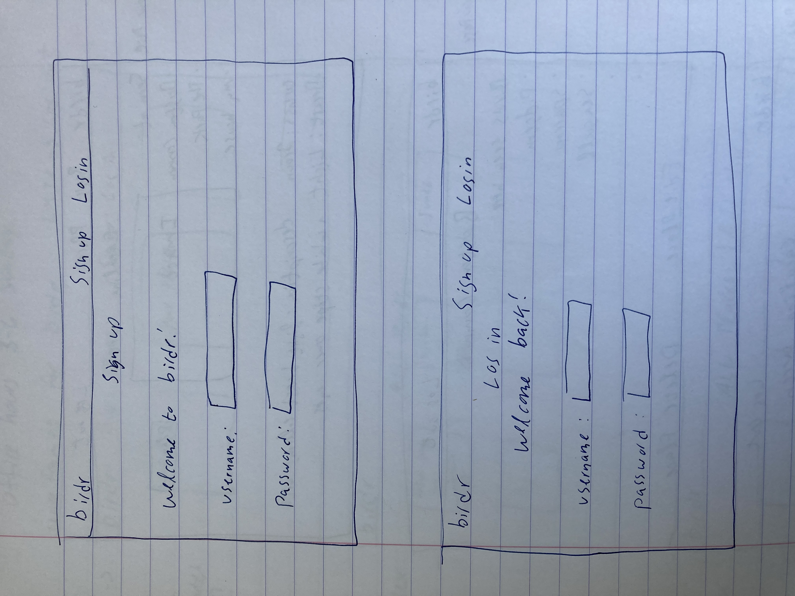

# birdr
An app where users can sign up, log in, log out, and keep track of birds they see and where they see them. There will be a database of birds with photos, info, and sound files. Users can add birds that they themselves have saeen, and list a place where they have seen them. Users can add their own places and each location will have a list of birds seen there. 

User Stories:
 -Navigate to page and see a page linking to :
    DONE-index of all birds
    DONE-index al locations
    DONE-add bird
    DONE-add location

-Click All birds and be able to:
    DONE-see a list of all birds in database 
    DONE-click on a bird to go to its page
    -On that page you will be able to:
        -click to add a bird to your list
        -click to go back
        DONE-click to edit the bird
        DONE-click to delete the bird

-Click Places and be able to:
    DONE-see a list of all the places
    DONE-click on a place and go to its page
    -On that page you will be able to:
        DONE-Maybe add google maps integration? inject the address into a maps.google url?
        DONE-Edit the place
        -see a list of birds added to that place
        -add and remove birds from the place
        -go back 

-Click "My Birds" and be able to:
    -See a list of the birds you have added
    -

Features:
-Add sighting counts to birds
-Add comments

ERD:

WireFrames:

Model: Bird

Field| Type 
--- | --- 
name | String 
description |String
sound | String
img | String
owners | 1 owner String
places | [placerefs]  push id onto it upon creation

Model: Place

Field| Type 
--- | --- 
name | String 
description |String
img | String
owner | String
birds | [birdrefs]

Model: User

Field| Type 
--- | --- 
username | String 
password |String

Route Table
| Route | Method | Description |
| - | - | - |
| / | GET | Birdr Home Page route |
| /birds | GET | Birds Index route |
| /places | GET | Places Index route |
| /birds/:id | GET | Birds show route |
| /places/:id | GET | Places show route |
| /users/signup | GET | Sign up route |
| /users/signup | POST | Sign up route |
| /users/login | GET | login route |
| /users/login | POST | login route |
| /users/logout | POST | logout route |
| /birds/:id | DELETE | Birds delete route |
| /places/:id | DELETE | Places delete route |
| /birds/:id/edit | GET | Birds edit route |
| /places/:id/edit | GET | Places edit route |
| /birds/:id | PUT | Birds update route |
| /places/:id | PUT | Places update route |
| /birds/new | GET | Birds create form route |
| /places/new | GET | Places create form route |
| /birds/ | POST | Birds create route |
| /places/ | POST | Places create route |
| /birds/mine | GET | list users birds route |
| /places/mine | GET | list users places route |

Seed 10 birds and 10 places

drop down for add place when adding a bird. 